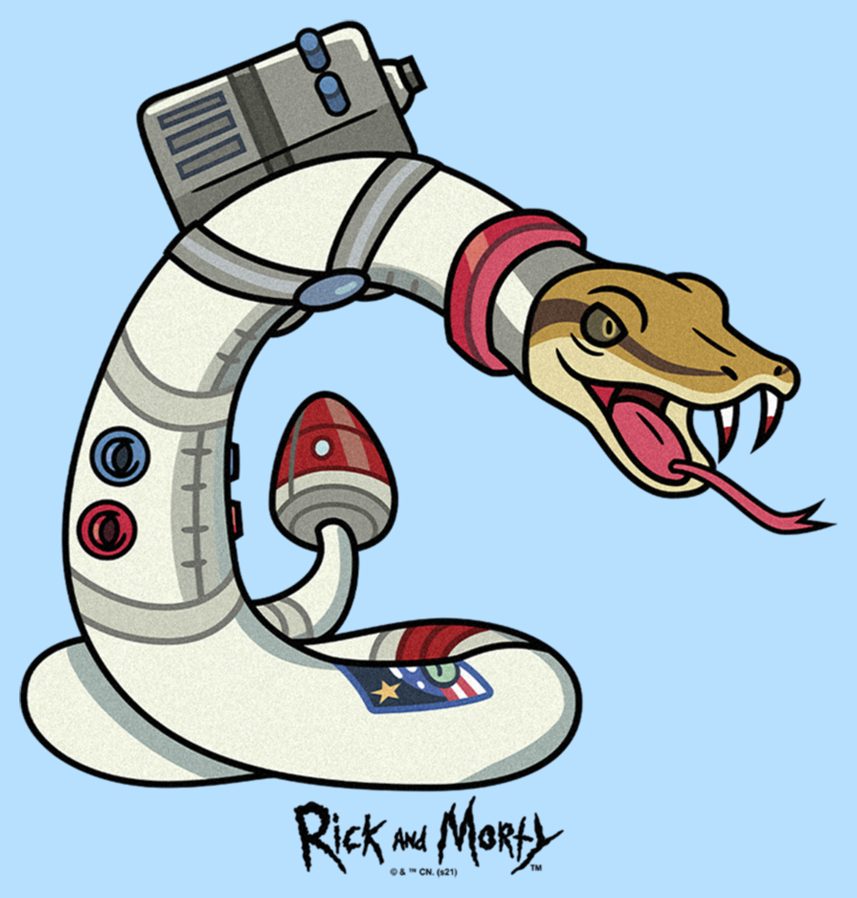

# Jararaca Language - The snake language from Brazil

Projeto criado para estudar conceitos de linguagens de programação.
O objetivo é criar uma nova linguagem conceitual comparando com as linguagens de programação atuais do mercado.

# Logo

Obviamente a logo deve ser uma cobra, e de traje espacial porque foguete não tem ré...
  
A imagem faz referência a seria Rick and Morty: Temporada 4, Episódio 5 

# Definições

arquivo com fontes tera extensão .jrc  
arquivo executavel tera extensao .pss (som da cobra)   